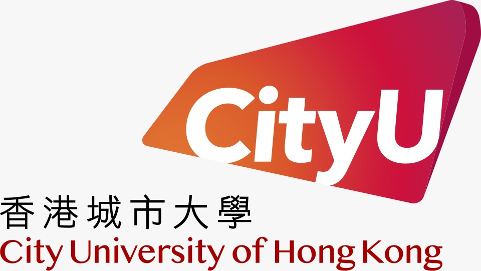
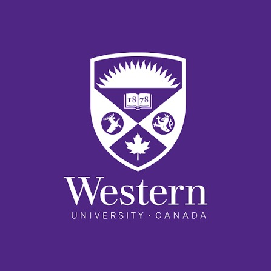
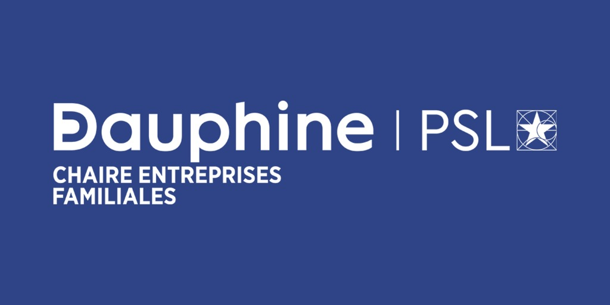
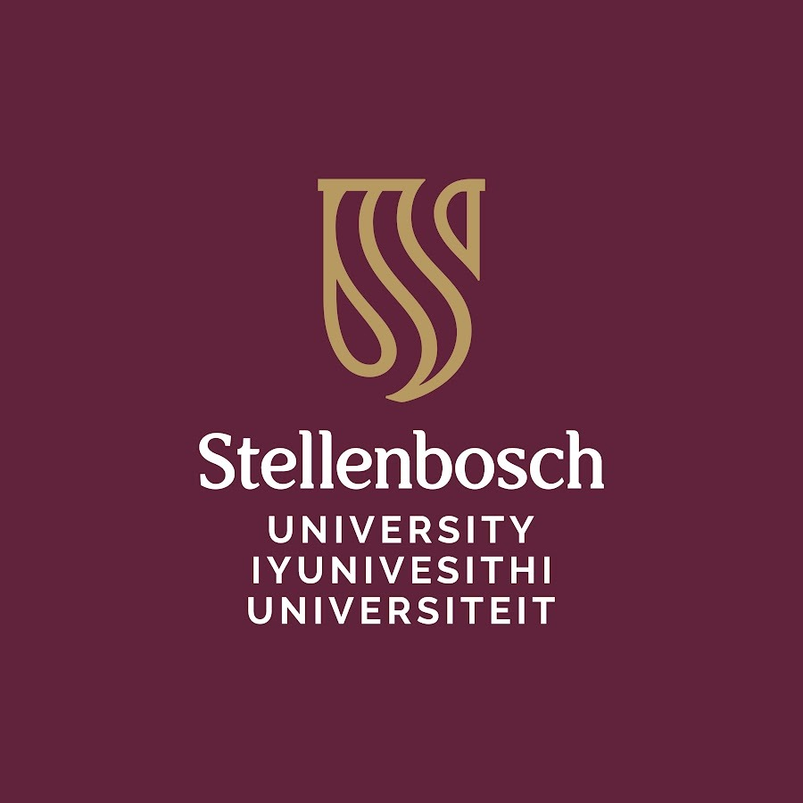
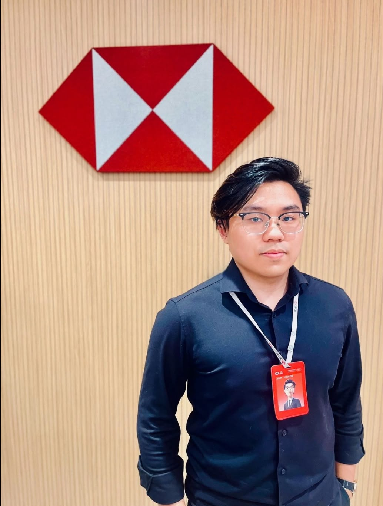
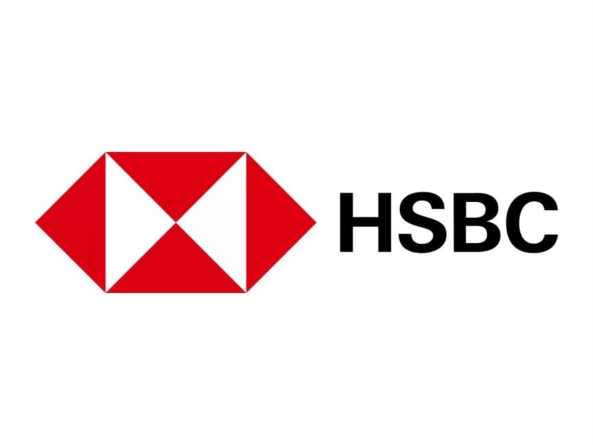
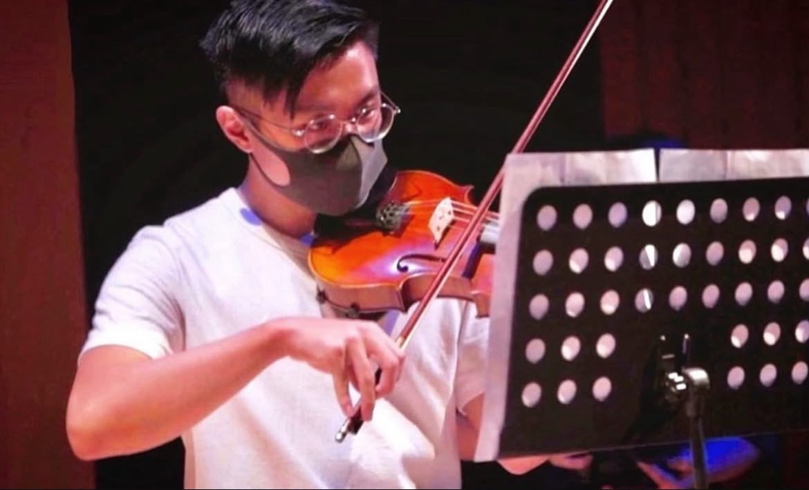
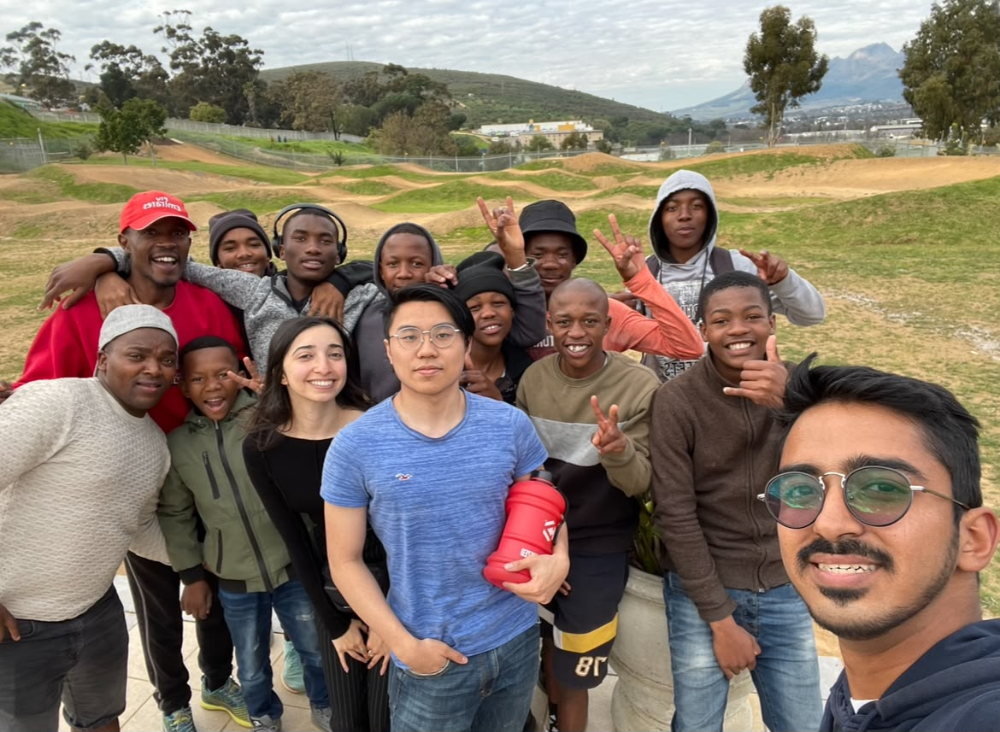
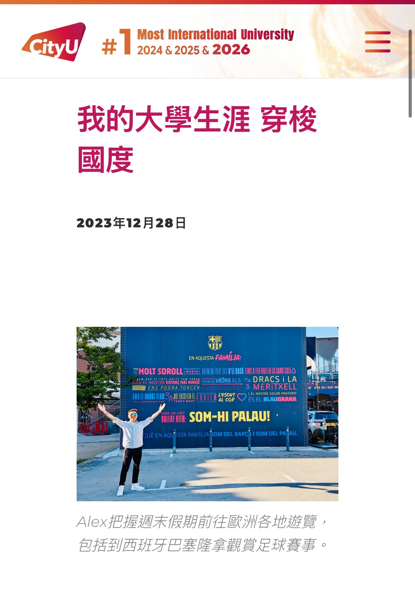
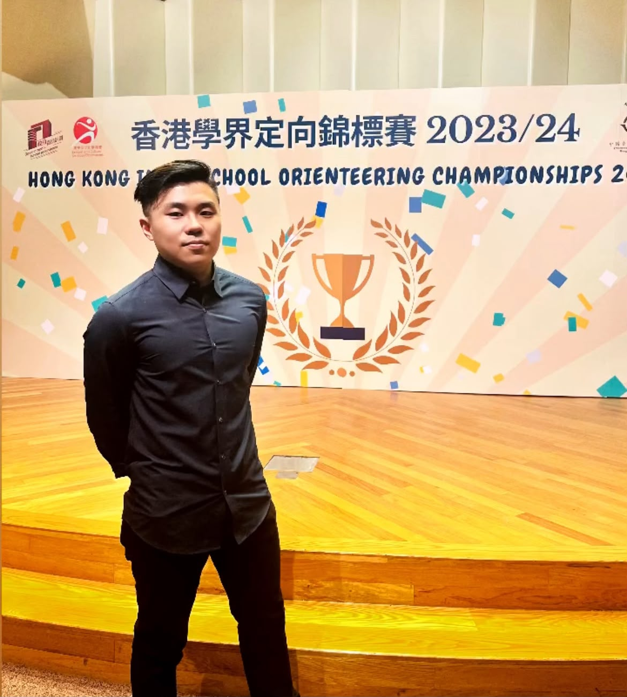

# Alex

---

## 👤 About Me

Hi everyone, I am Alex.

A tech-lover who enjoys RPG—Reading, Photography, and Gym.

---

## 🎓 Education

### City University of Hong Kong (Hong Kong)

**BBA in Global Business Systems Management, 2021–2026**

### Exchange Programs

- **Western University (Canada), 2024** 
- **Paris Dauphine University – PSL (France), 2023** 
- **Stellenbosch University (South Africa), 2023** 
- **Tsinghua University (China), 2017–2018** 

---

## 💼 Work Experience

### 2025: HSBC Private Banking

---

## 🏆 Achievements

- **Global Traveling**: Participated in global university exchange programs and official travel initiatives - [Read more](https://cityu.edu.hk/media/news/2023/12/28/global-journey-south-africa-paris-and-beyond) 
- **Career**: Joined HSBC Private Banking, my previous career goal 
- **Sports**: Selected for the Hong Kong Orienteering Team with a sports scholarship 
- **Music**: Performed at the Beijing National Theatre for the Hong Kong Handover Anniversary 
- **Volunteering**: Taught IT skills to local students in South Africa 

---

## 📚 Books Recommendation

### 1. 應用哲學 (Applied Philosophy) - 14 Books

- The Wisdom of Life
- 讓孤獨成為你的人生時尚
- 少有人走的路
- 財富自由之路
- 神話與未知
- 死亡與天堂
- 人與社會
- 虛擬世界
- 科技將來
- 設計你的理想人生
- 高價值人生法則全書
- 7 Habits of Highly Effective People
- Great at Work
- Human Weakness (卡耐基)

### 2. 心理學 (Psychology)

- 快思慢想 (Thinking, Fast and Slow)
- 烏合之眾 (The Crowd: A Study of the Popular Mind)
- Influence
- 吸引力法則
- 被討厭的勇氣 (The Courage to Be Disliked)
- 菊與刀
- Korean Culture Study

### 3. 兩性相處 (Relationships & Gender Dynamics)

- Male and Female 男女對弈
- 野獸紳士
- 進化心理學 (Evolutionary Psychology)
- Male+Female+Difference+Model
- Male+Female+Difference+Model 2.0 & 3.0

### 4. 商業 (Business)

- [From Zero to One](society/5.0-business/2026-04-06-zero-to-one)
- [精實創業](society/5.0-business/2026-04-06-lean-startup)
- 先問為什麼 (Ask Why)
- 定位 (Position)
- 創新的兩難 (The Dilemma of Innovation)
- 策略思維
- 職場心法
- [The Changing World Order](society/4.0-finance/2026-04-06-the-changing-world-order)

### 5. 金融 (Finance)

- [投資最重要的事 (Howard Marks)](society/4.0-finance/2026-04-06-most-important-thing)
- [選股戰略 (Peter Lynch)](society/4.0-finance/2026-04-06-peter-lynch-strategy)
- 多空操作秘笈
- 冠軍魔術師 II (Mark Minervini)
- 金融概念
- 宏觀經濟學
- Investment All in 1

### 6. 雜項/生活百科 (Grocery)

- How to Sleep Well
- How to Take Photos Well
- How to Read a Book

---

## 🎯 Interests & Hobbies

### Reading

[Patreon: InspireWisdom](http://patreon.com/InspireWisdom?utm_campaign=creatorshare_creator)

### Photography

### Gym

---

## 📧 Contact

**Email**: Alexau1121@gmail.com

---

*最後更新：2026-06-25*
